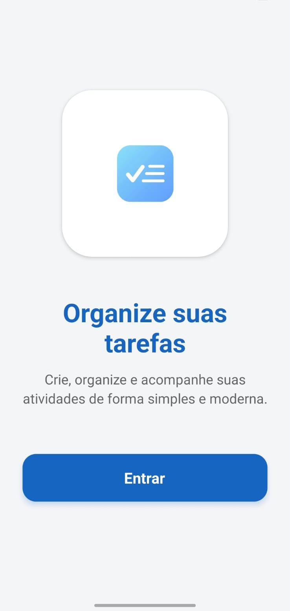
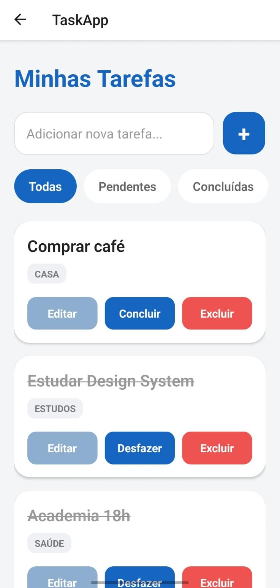
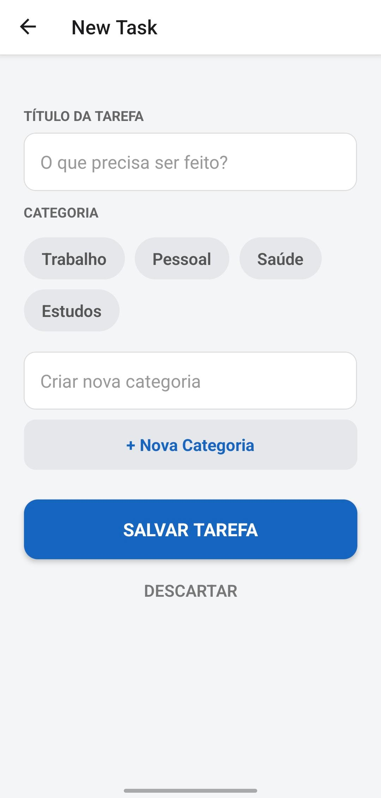

# TaskApp

Aplicativo mobile de gerenciamento de tarefas desenvolvido com React Native + Expo.

O projeto permite criar, editar, concluir e excluir tarefas, além de filtrar por status e organizar atividades por categoria.

## Funcionalidades

- Tela de boas-vindas
- Lista de tarefas com persistência local (AsyncStorage)
- Criação rápida de tarefa
- Edição de tarefa
- Marcação de tarefa como concluída
- Exclusão de tarefa
- Filtro por status: todas, pendentes e concluídas
- Categorias pré-definidas e criação de novas categorias
- Estado visual para lista vazia
- Confirmação antes de excluir tarefa

## Tecnologias utilizadas

- React Native
- Expo
- TypeScript
- React Navigation (Native Stack)
- AsyncStorage

## Estrutura principal

```txt
src/
  components/
    TaskItem.tsx
  screens/
    WelcomeScreen.tsx
    HomeScreen.tsx
    NewTask.tsx
```

## Pré-requisitos

- Node.js (versão LTS recomendada)
- npm
- Expo Go no celular (opcional) ou emulador Android/iOS

## Como executar o projeto

### 1. Instalar dependências

```bash
npm install
```

### 2. Rodar o projeto

```bash
npm run start
```

Opcionalmente:

```bash
npm run android
npm run ios
npm run web
```

## Fluxo de uso

1. Acesse a tela inicial e toque em Entrar.
2. Na Home, adicione uma tarefa rapidamente pelo campo superior.
3. Complete, edite ou exclua tarefas pelos botões de ação.
4. Use os filtros para visualizar tarefas pendentes ou concluídas.
5. Em New Task, escolha ou crie uma categoria e salve.

## Navegação entre telas

- Welcome: entrada inicial do app
- Home: listagem, criação rápida e filtros de tarefas
- NewTask: criação e edição de tarefas

## Screenshots

As imagens do app estão na pasta assets:

<h3 align="center">Welcome Screen</h3>

<p align="center">
  
</p>

<h3 align="center">Home Screen</h3>

<p align="center">
  
</p>

<h3 align="center">New Task Screen</h3>

<p align="center">
  
</p>

## Armazenamento local

As tarefas são persistidas com AsyncStorage usando a chave:

```txt
@taskapp:tarefas
```

## Melhorias futuras

- Busca por título de tarefa
- Persistência de categorias personalizadas
- Priorização e prazo de tarefas
- Testes automatizados de componentes e telas

## Licença

Projeto para fins educacionais.

## Autor

Letícia Alves
